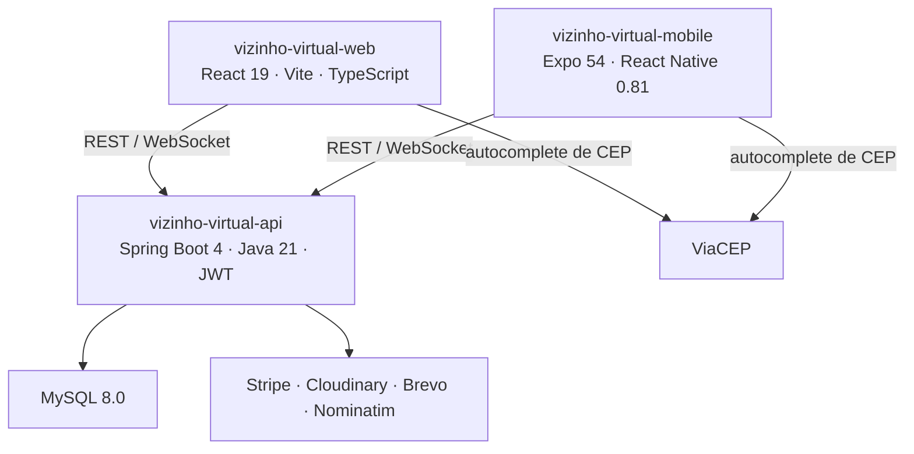
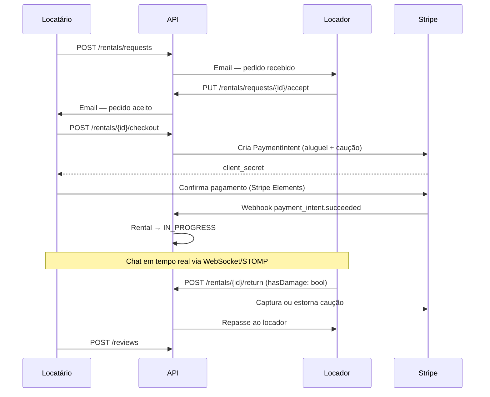

# Vizinho Virtual

**Marketplace de aluguel e empréstimo entre vizinhos — em produção.**

[vizinhovirtual.com.br](https://vizinhovirtual.com.br)

---

## O Produto

Vizinho Virtual conecta donos de itens ociosos a pessoas que precisam desses itens por um período limitado. Em vez de comprar, o usuário aluga de um vizinho.

**Locador** — anuncia itens, define disponibilidade, aceita pedidos e recebe repasse após a devolução.

**Locatário** — descobre itens por busca ou categoria, solicita locação, paga via Stripe e avalia ao final.

O ciclo completo abrange:

```
cadastro → ativação por email → anúncio → pedido → checkout com caução
  → chat em tempo real → devolução → avaliação → repasse ao locador
```

---

## Funcionalidades

| Área | Descrição |
|------|-----------|
| Autenticação | Registro com upload de foto, ativação por email, login JWT, reset de senha por token |
| Catálogo | Criação e edição de itens com múltiplas imagens, categorias, favoritos, busca e filtros |
| Locação | Pedido de locação, aceite/recusa/cancelamento, disponibilidade por período |
| Pagamento | Checkout via Stripe Elements, caução autorizada no checkout e capturada/estornada na devolução |
| Chat | Mensagens em tempo real via WebSocket/STOMP vinculadas à locação |
| Avaliações | Avaliação mútua após conclusão da locação |
| Notificações | Notificações in-app para eventos do ciclo de locação |
| Denúncias | Reporte de itens ou usuários para moderação |
| Admin | Painel administrativo: gestão de usuários, itens, denúncias e logs de auditoria |

---

## Arquitetura



A API é o centro de contratos, regras de negócio e integrações. Web e mobile são clientes que consomem services centralizados.

### Módulos da API

```
vizinho-virtual-api/src/main/java/br/com/vizinhovirtual/
├── core/
│   ├── config/         CORS · JWT · Cloudinary · OpenAPI
│   ├── dto/            PagedResponse genérico
│   ├── exceptions/     Hierarquia de erros + GlobalExceptionHandler
│   ├── security/       JwtFilter · JwtTokenProvider · SessionValidation
│   └── service/        CloudinaryService · EmailService
└── modules/
    ├── auth/           Registro · Login · Ativação · Reset de senha
    ├── user/           Perfil · Senha · Imagem · Sessão
    ├── catalog/        Categorias · Itens · Favoritos · Imagens
    ├── rental/         Pedidos · Detalhes · Disponibilidade
    ├── finance/        Checkout · Devolução · Pagamento · Caução · Repasse
    ├── interaction/    Chat · Avaliações · Notificações · Denúncias · Auditoria
    ├── admin/          Dashboard · Gestão de usuários · Itens · Denúncias
    └── support/        Tickets de suporte
```

---

## Fluxo Principal de Locação



---

## Stack

### Backend

| Tecnologia | Versão | Uso |
|-----------|--------|-----|
| Java | 21 | Runtime · Virtual Threads (Project Loom) |
| Spring Boot | 4.0.5 | Framework principal |
| Spring Security + JWT | — | Autenticação stateless |
| Spring Data JPA + Hibernate | — | Persistência |
| MySQL | 8.0 | Banco de dados (Docker) |
| H2 | — | Banco em memória para testes |
| Stripe Java SDK | 28.4.0 | Pagamentos e caução |
| Cloudinary SDK | 1.39.0 | Upload e CDN de imagens |
| Spring Mail + Brevo | — | Emails transacionais |
| Spring WebSocket + STOMP | — | Chat em tempo real |
| SpringDoc OpenAPI | 2.8.5 | Swagger em `/swagger-ui.html` |
| Nominatim (OpenStreetMap) | — | Geocodificação de endereços |

### Frontend Web

| Tecnologia | Versão |
|-----------|--------|
| React | 19.2 |
| TypeScript | 5.9 |
| Vite | 7.3 |
| React Router DOM | 7.13 |
| TanStack React Query | 5.90 |
| Zustand | 5.0 |
| Zod | 4.3 |
| Axios | 1.13 |
| React Hook Form | 7.71 |
| Stripe Elements | 3.9 |
| Leaflet | 1.9 |

### Mobile

| Tecnologia | Versão |
|-----------|--------|
| Expo | 54.0 |
| React Native | 0.81.5 |
| Expo Router | 6.0 |
| TypeScript | 5.9 |
| TanStack React Query | 5.90 |
| Expo Secure Store | 15.0 |
| STOMP.js | 7.3 |

---

## Repositórios

| Módulo | Descrição |
|--------|-----------|
| [vizinho-virtual-api](https://github.com/vizinho-virtual/vizinho-virtual-api) | API REST + WebSocket — Java 21 · Spring Boot 4 |
| [vizinho-virtual-web](https://github.com/vizinho-virtual/vizinho-virtual-web) | SPA — React 19 · TypeScript · Vite |
| [vizinho-virtual-mobile](https://github.com/vizinho-virtual/vizinho-virtual-mobile) | App — Expo 54 · React Native 0.81 |
| [vizinho-virtual-docs](https://github.com/vizinho-virtual/vizinho-virtual-docs) | Documentação histórica e material do TCC |

---

## Screenshots

> Imagens a adicionar após capturas do ambiente de produção.

| Tela | Arquivo |
|------|---------|
| Home / Explorar | `docs/assets/screenshots/home.png` |
| Detalhes do item | `docs/assets/screenshots/item-details.png` |
| Checkout | `docs/assets/screenshots/checkout.png` |
| Chat | `docs/assets/screenshots/chat.png` |
| Mobile — Home | `docs/assets/screenshots/mobile-home.png` |
| Mobile — Anunciar | `docs/assets/screenshots/mobile-anunciar.png` |

---

## Diferenciais Técnicos

**Virtual Threads (Project Loom)**
`spring.threads.virtual.enabled=true` — atende picos de conexões simultâneas com baixo consumo de memória sem alterar o modelo de programação.

**Segurança em camadas**
JWT stateless com expiração configurável + invalidação de sessão via `UserSession` no banco + verificação de email obrigatória no registro + reset de senha por token UUID de uso único com TTL curto.

**Caução via Stripe**
O depósito é autorizado no checkout (não capturado) e capturado ou estornado na devolução conforme o estado do item, sem manter saldo em custódia indefinida.

**Webhook com verificação HMAC**
`POST /api/stripe/webhook` verifica a assinatura via `Stripe-Signature` antes de processar qualquer evento, garantindo que apenas eventos legítimos alteram o estado da locação.

**Privacidade de localização**
Itens exibem localização aproximada (raio configurável, padrão 1 km) para usuários não autenticados, preservando o endereço exato do locador.

**Arquitetura modular por domínio**
Cada módulo da API agrupa controller, service, entidade, repositório e DTOs em um único contexto delimitado. Módulos se comunicam exclusivamente por interfaces de serviço.

---

## Roadmap

| Item | Status |
|------|--------|
| Auth completo (registro · login · ativação · reset) | Concluído |
| Catálogo (CRUD de itens · imagens · favoritos) | Concluído |
| Pedido de locação (aceitar · recusar · cancelar) | Concluído |
| Checkout Stripe + caução | Concluído |
| Webhook Stripe com verificação HMAC | Concluído |
| Chat em tempo real (WebSocket + STOMP) | Concluído |
| Avaliações | Concluído |
| Notificações in-app | Concluído |
| Denúncias | Concluído |
| Painel administrativo (API + Mobile) | Concluído |
| App mobile (Expo + Expo Router) | Concluído |
| Geolocalização (busca por raio) | Roadmap |
| Painel admin no web | Roadmap |

---

## Documentação Complementar

| Recurso | Conteúdo |
|---------|----------|
| `AGENTS.md` | Guia operacional para agentes de IA |
| `architecture/README.md` | Visão arquitetural, princípios e padrões |
| `adr/` | Architecture Decision Records |
| `specs/` | Especificações por módulo (API, Web, Mobile) |
| `playbooks/` | Fluxos recorrentes de desenvolvimento e debug |
| [vizinho-virtual-docs](https://github.com/vizinho-virtual/vizinho-virtual-docs) | Documentação técnica detalhada, endpoints e histórico |

---

## Status

Produto em produção em [vizinhovirtual.com.br](https://vizinhovirtual.com.br).
